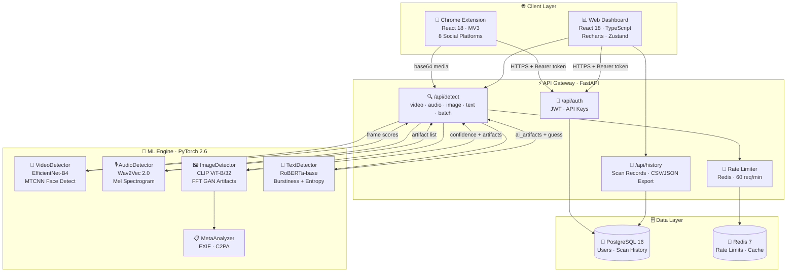
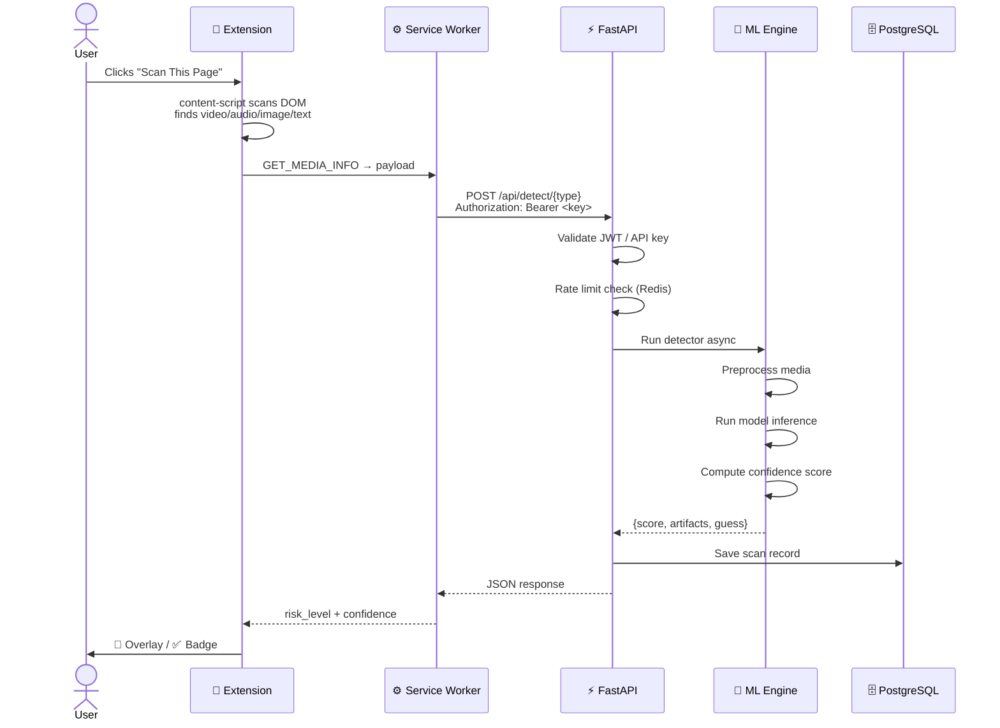
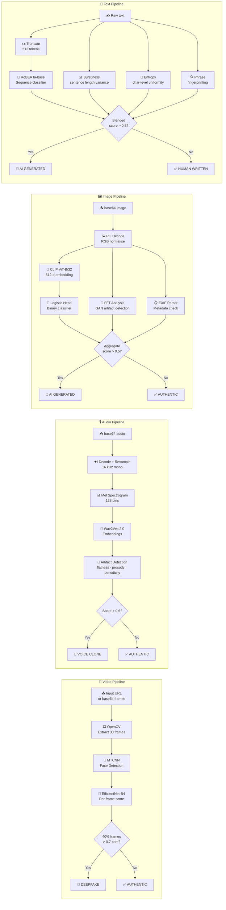

<div align="center">

<!-- ═══════════════════════  OFFICIAL LOGO  ═══════════════════════ -->


<!-- ════════════════  SVG HERO BANNER  ════════════════ -->
<svg xmlns="http://www.w3.org/2000/svg" viewBox="0 0 900 220" width="900" height="220">
  <defs>
    <linearGradient id="bg" x1="0%" y1="0%" x2="100%" y2="100%">
      <stop offset="0%" style="stop-color:#0f0c29"/>
      <stop offset="50%" style="stop-color:#302b63"/>
      <stop offset="100%" style="stop-color:#24243e"/>
    </linearGradient>
    <linearGradient id="lens" x1="0%" y1="0%" x2="100%" y2="100%">
      <stop offset="0%" style="stop-color:#00d2ff"/>
      <stop offset="100%" style="stop-color:#7b2ff7"/>
    </linearGradient>
    <filter id="glow">
      <feGaussianBlur stdDeviation="3" result="coloredBlur"/>
      <feMerge><feMergeNode in="coloredBlur"/><feMergeNode in="SourceGraphic"/></feMerge>
    </filter>
  </defs>
  <rect width="900" height="220" rx="18" fill="url(#bg)"/>
  <line x1="0" y1="55" x2="900" y2="55" stroke="#ffffff08" stroke-width="1"/>
  <line x1="0" y1="110" x2="900" y2="110" stroke="#ffffff08" stroke-width="1"/>
  <line x1="0" y1="165" x2="900" y2="165" stroke="#ffffff08" stroke-width="1"/>
  <line x1="225" y1="0" x2="225" y2="220" stroke="#ffffff08" stroke-width="1"/>
  <line x1="450" y1="0" x2="450" y2="220" stroke="#ffffff08" stroke-width="1"/>
  <line x1="675" y1="0" x2="675" y2="220" stroke="#ffffff08" stroke-width="1"/>
  <circle cx="80" cy="110" r="44" fill="none" stroke="url(#lens)" stroke-width="7" filter="url(#glow)"/>
  <circle cx="80" cy="110" r="28" fill="#00d2ff22"/>
  <line x1="80" y1="82" x2="80" y2="138" stroke="#00d2ff" stroke-width="2" opacity="0.6"/>
  <line x1="52" y1="110" x2="108" y2="110" stroke="#00d2ff" stroke-width="2" opacity="0.6"/>
  <line x1="114" y1="144" x2="140" y2="170" stroke="url(#lens)" stroke-width="8" stroke-linecap="round" filter="url(#glow)"/>
  <text x="175" y="100" font-family="'Segoe UI',Arial,sans-serif" font-size="62" font-weight="900" fill="url(#lens)" filter="url(#glow)">TruthLens</text>
  <text x="178" y="140" font-family="'Segoe UI',Arial,sans-serif" font-size="20" fill="#c3b8ff" letter-spacing="2">Real-Time Deepfake &amp; Media Authenticity Shield</text>
  <rect x="178" y="158" width="100" height="26" rx="13" fill="#00d2ff22" stroke="#00d2ff" stroke-width="1"/>
  <text x="228" y="176" font-family="Arial,sans-serif" font-size="12" fill="#00d2ff" text-anchor="middle">&#127909; Video</text>
  <rect x="290" y="158" width="100" height="26" rx="13" fill="#7b2ff722" stroke="#7b2ff7" stroke-width="1"/>
  <text x="340" y="176" font-family="Arial,sans-serif" font-size="12" fill="#c084fc" text-anchor="middle">&#127908; Audio</text>
  <rect x="402" y="158" width="100" height="26" rx="13" fill="#f59e0b22" stroke="#f59e0b" stroke-width="1"/>
  <text x="452" y="176" font-family="Arial,sans-serif" font-size="12" fill="#fbbf24" text-anchor="middle">&#128444; Image</text>
  <rect x="514" y="158" width="120" height="26" rx="13" fill="#10b98122" stroke="#10b981" stroke-width="1"/>
  <text x="574" y="176" font-family="Arial,sans-serif" font-size="12" fill="#34d399" text-anchor="middle">&#9889; Real-Time</text>
  <rect x="646" y="158" width="100" height="26" rx="13" fill="#6366f122" stroke="#6366f1" stroke-width="1"/>
  <text x="696" y="176" font-family="Arial,sans-serif" font-size="12" fill="#a5b4fc" text-anchor="middle">&#128221; Text</text>
  <rect x="758" y="158" width="120" height="26" rx="13" fill="#ef444422" stroke="#ef4444" stroke-width="1"/>
  <text x="818" y="176" font-family="Arial,sans-serif" font-size="12" fill="#f87171" text-anchor="middle">&#128737; Production Ready</text>
</svg>

---

<!-- ════════════════════════  BADGE ROW  ════════════════════════ -->

[](https://python.org)
[](https://fastapi.tiangolo.com)
[](https://pytorch.org)
[](https://react.dev)
[](https://typescriptlang.org)
[](https://docker.com)

[](https://postgresql.org)
[](https://redis.io)
[](https://developer.chrome.com/docs/extensions/mv3/)
[](LICENSE)
[](https://github.com/Rahulchaube1/TruthLens-/pulls)
[](https://github.com/Rahulchaube1)

</div>

---

## 🌟 What is TruthLens?

> **TruthLens** is a full-stack, AI-powered platform that detects deepfake videos, cloned voices, AI-generated images, and AI-written text — **in real time** — before misinformation spreads.
> Built for the **general public**, **journalists**, **enterprises**, and **researchers** who need to trust the media they consume and share.

**TruthLens** is the most essential tool in the age of synthetic media. Whether you're a content creator, news professional, cybersecurity researcher, social media moderator, or an everyday internet user — TruthLens has you covered.

<div align="center">

| 🎯 Problem | 💡 TruthLens Solution |
|:---:|:---:|
| Deepfakes are indistinguishable to the human eye | EfficientNet-B4 + MTCNN per-frame analysis |
| Voice cloning fools millions daily | Wav2Vec 2.0 spectral & prosody fingerprinting |
| AI images flood social media | CLIP classifier + GAN artifact FFT detection |
| AI-generated text spreads as real news | RoBERTa classifier + burstiness/entropy heuristics |
| No browser-native protection exists | Chrome Extension (MV3) scans pages automatically |
| No unified dashboard for teams | React analytics dashboard with real-time charts |
| Manual review is slow and error-prone | Batch scanning API — analyse 10 items in one call |
| No audit trail for compliance | CSV/JSON history export for reporting & forensics |

</div>

---

## ✨ Feature Highlights

<div align="center">

```
╔════════════════════════════════════════════════════════════════════════════════════╗
║                           TRUTHLENS  FEATURE MAP v2.0                             ║
╠══════════════╦══════════════════╦═══════════════════╦════════════╦════════════════╣
║  🎥 VIDEO    ║   🎙️  AUDIO      ║   🖼️  IMAGE        ║  📝 TEXT   ║  🛡️  PLATFORM  ║
╠══════════════╬══════════════════╬═══════════════════╬════════════╬════════════════╣
║ EfficientNet ║ Wav2Vec 2.0      ║ CLIP Embeddings   ║ RoBERTa    ║ FastAPI REST   ║
║ B4 deepfake  ║ voice clone      ║ AI-gen classifier ║ AI-text    ║ JWT + API key  ║
║ classifier   ║ detection        ║                   ║ detector   ║ auth           ║
║              ║                  ║                   ║            ║                ║
║ MTCNN face   ║ Mel spectrogram  ║ GAN artifact FFT  ║ Burstiness ║ Redis rate     ║
║ detection &  ║ analysis         ║ (checkerboard     ║ & entropy  ║ limiting       ║
║ alignment    ║                  ║  pattern detect)  ║ analysis   ║ (60 req/min)   ║
║              ║                  ║                   ║            ║                ║
║ 30-frame     ║ Prosody variance ║ EXIF metadata     ║ LLM model  ║ PostgreSQL     ║
║ temporal     ║ anomaly check    ║ inconsistency     ║ guess      ║ history        ║
║ analysis     ║                  ║ analysis          ║            ║ Chrome Ext MV3 ║
║              ║                  ║                   ║            ║ React dashboard║
║              ║                  ║                   ║            ║ Batch scan API ║
║              ║                  ║                   ║            ║ CSV/JSON export║
╚══════════════╩══════════════════╩═══════════════════╩════════════╩════════════════╝
```

</div>

---

## 🚀 New & Advanced Features

### 📝 AI-Generated Text Detection
Detect whether an article, social media post, email, or document was written by a large language model (ChatGPT, GPT-4, Claude, Gemini, Llama, Mistral, etc.) using:
- **RoBERTa-base** fine-tuned on OpenAI's human/AI text dataset
- **Burstiness analysis** — human writing has variable sentence length; LLMs don't
- **Lexical entropy** — detect unnaturally uniform vocabulary
- **LLM phrase fingerprinting** — "furthermore", "it is important to note", etc.
- Returns `generator_model_guess` (e.g., "GPT-4 / Claude / Gemini")

### 📦 Batch Scanning API
Analyse up to **10 media items in a single API call** — mix videos, images, audio clips, and text in one request. Perfect for:
- Social media moderation pipelines
- News agency verification workflows
- Enterprise compliance auditing

### 📊 History Export (CSV & JSON)
Export your complete scan history for:
- Compliance reporting and forensic audits
- Integration with SIEM tools and dashboards
- Offline analysis in Excel, pandas, or BI tools

### 🔍 Advanced Risk Scoring
Every detection returns a **4-tier risk level** (Low / Medium / High / Critical) with confidence scores, artifact lists, and generator model guesses — giving you full transparency into every decision.

### 🌐 8-Platform Browser Coverage
The Chrome Extension automatically scans media on YouTube, Twitter/X, Facebook, Instagram, LinkedIn, Reddit, TikTok, and any web page — with visual overlays that appear before you share.

---

## 🏗️ System Architecture



---

## 🔄 End-to-End Workflow



---

## 🧠 ML Pipeline Deep Dive



---

## 🧩 Project Structure

```
TruthLens-/
│
├── 📁 backend/                     # Python 3.11 · FastAPI · PyTorch
│   ├── main.py                     # App entry, CORS, lifespan hooks
│   ├── api/routes/
│   │   ├── auth.py                 # POST /register  /login  GET /apikey
│   │   ├── detect.py               # POST /video  /audio  /image  /text  /batch
│   │   └── history.py              # GET  /history  GET /history/export
│   ├── ml/
│   │   ├── video_detector.py       # EfficientNet-B4 + MTCNN
│   │   ├── audio_detector.py       # Wav2Vec 2.0 classifier
│   │   ├── image_detector.py       # CLIP + FFT GAN detector
│   │   ├── text_detector.py        # RoBERTa AI-text classifier  ← NEW
│   │   ├── model_loader.py         # Async model bootstrap
│   │   └── preprocessors.py        # Frames, mel, base64 utils
│   ├── db/
│   │   ├── models.py               # SQLAlchemy ORM (User, ScanResult)
│   │   └── schemas.py              # Pydantic schemas
│   ├── utils/
│   │   ├── rate_limiter.py         # Redis sliding-window
│   │   └── metadata_analyzer.py    # EXIF / C2PA checks
│   ├── requirements.txt
│   └── Dockerfile
│
├── 📁 extension/                   # Chrome Extension · Manifest V3
│   ├── manifest.json               # MV3, 8 platform host perms
│   ├── src/
│   │   ├── popup/Popup.tsx         # React popup UI
│   │   ├── content/content-script.ts # DOM scanner + overlay
│   │   ├── background/service-worker.ts # Alarm + API relay
│   │   └── components/             # RiskBadge, ScanResult
│   └── vite.config.ts
│
├── 📁 dashboard/                   # Web Dashboard · React 18 · TS
│   └── src/
│       ├── pages/
│       │   ├── Home.tsx            # Quick scan + stats
│       │   ├── History.tsx         # Scan history table
│       │   ├── Analytics.tsx       # Recharts visualisations
│       │   └── Settings.tsx        # Auth + API key mgmt
│       ├── store/useStore.ts       # Zustand + persist
│       ├── api/client.ts           # Axios + JWT interceptor
│       └── components/             # Navbar, StatCard, RiskBadge
│
└── 🐳 docker-compose.yml           # postgres · redis · backend · dashboard
```

---

## 🚀 Quick Start

### Option 1 — Docker (Recommended)

```bash
# 1. Clone
git clone https://github.com/Rahulchaube1/TruthLens-
cd TruthLens-

# 2. Set secrets (optional — defaults work for local dev)
export JWT_SECRET_KEY=your-super-secret-key
export POSTGRES_PASSWORD=your-db-password

# 3. Launch everything
docker-compose up --build
```

| Service | URL |
|---------|-----|
| 🔵 REST API | http://localhost:8000 |
| 📘 Swagger Docs | http://localhost:8000/docs |
| 📊 Dashboard | http://localhost:3000 |

---

### Option 2 — Local Development

<details>
<summary><b>🐍 Backend</b></summary>

```bash
cd backend
pip install -r requirements.txt
uvicorn main:app --reload --port 8000
```
</details>

<details>
<summary><b>📊 Dashboard</b></summary>

```bash
cd dashboard
npm install
npm run dev    # → http://localhost:3000
```
</details>

<details>
<summary><b>🔌 Chrome Extension</b></summary>

```bash
cd extension
npm install
npm run build  # → extension/dist/
```

1. Open `chrome://extensions`
2. Enable **Developer mode** (top-right toggle)
3. Click **Load unpacked** → select `extension/dist/`
4. Pin **TruthLens** to your toolbar — done! 🎉
</details>

---

## 📡 API Reference

### 🔐 Authentication

```http
POST /api/auth/register
Content-Type: application/json

{ "email": "user@example.com", "password": "s3cr3t!", "name": "Alice" }
```

```http
POST /api/auth/login
Content-Type: application/json

{ "email": "user@example.com", "password": "s3cr3t!" }
```

```http
GET /api/auth/apikey
Authorization: Bearer <jwt_token>
```

---

### 🎥 Video Deepfake Detection

```http
POST /api/detect/video
Authorization: Bearer <token>

{
  "url": "https://example.com/video.mp4",
  "frames": ["<base64_frame_1>", "<base64_frame_2>"]
}
```

```jsonc
// Response
{
  "is_deepfake": true,
  "confidence": 0.87,           // 0.0 – 1.0
  "frame_scores": [0.82, 0.91, 0.79],
  "detection_time_ms": 342,
  "risk_level": "high"          // low | medium | high | critical
}
```

---

### 🎙️ Audio Voice Clone Detection

```http
POST /api/detect/audio
Authorization: Bearer <token>

{
  "audio_base64": "<base64_audio>",
  "duration_seconds": 12.5
}
```

```jsonc
// Response
{
  "is_cloned": true,
  "confidence": 0.73,
  "voice_artifacts": ["high_spectral_flatness", "low_prosody_variance"],
  "synthesis_model_guess": "Tortoise-TTS / VALL-E"
}
```

---

### 🖼️ Image AI Generation Detection

```http
POST /api/detect/image
Authorization: Bearer <token>

{
  "image_base64": "<base64_image>",
  "check_metadata": true
}
```

```jsonc
// Response
{
  "is_ai_generated": true,
  "confidence": 0.94,
  "gan_artifacts": true,
  "metadata_inconsistencies": ["No EXIF metadata found — possible AI generation"],
  "generator_model_guess": "Stable Diffusion / DALL-E"
}
```

---

### 📝 AI-Generated Text Detection ← NEW

```http
POST /api/detect/text
Authorization: Bearer <token>

{
  "text": "Paste any article, social media post, or document here..."
}
```

```jsonc
// Response
{
  "is_ai_generated": true,
  "confidence": 0.91,
  "ai_artifacts": ["low_burstiness", "repetitive_phrasing"],
  "generator_model_guess": "GPT-4 / Claude / Gemini",
  "word_count": 312,
  "sentence_count": 18,
  "risk_level": "critical"
}
```

---

### 📦 Batch Detection ← NEW

Analyse up to **10 items** (any mix of types) in a single request:

```http
POST /api/detect/batch
Authorization: Bearer <token>

{
  "items": [
    { "type": "video", "url": "https://example.com/video.mp4" },
    { "type": "image", "image_base64": "<base64>" },
    { "type": "text",  "text": "Article content here..." },
    { "type": "audio", "audio_base64": "<base64>", "duration_seconds": 8.0 }
  ]
}
```

```jsonc
// Response
{
  "results": [
    { "index": 0, "type": "video", "success": true, "result": { "is_deepfake": false, "confidence": 0.12, "risk_level": "low" }, "detection_time_ms": 210 },
    { "index": 1, "type": "image", "success": true, "result": { "is_ai_generated": true, "confidence": 0.88, "risk_level": "critical" }, "detection_time_ms": 145 },
    { "index": 2, "type": "text",  "success": true, "result": { "is_ai_generated": true, "confidence": 0.79, "risk_level": "high" }, "detection_time_ms": 98 },
    { "index": 3, "type": "audio", "success": true, "result": { "is_cloned": false, "confidence": 0.21 }, "detection_time_ms": 320 }
  ],
  "total": 4,
  "succeeded": 4,
  "failed": 0,
  "total_time_ms": 773
}
```

---

### 📜 Scan History & Export ← NEW

```http
GET /api/history?limit=50
Authorization: Bearer <token>
```

```http
# Export as CSV (for Excel, pandas, BI tools)
GET /api/history/export?format=csv&limit=500
Authorization: Bearer <token>

# Export as JSON (for SIEM, APIs, forensics)
GET /api/history/export?format=json&limit=500
Authorization: Bearer <token>
```

---

## 🔧 Environment Variables

| Variable | Default | Required | Description |
|----------|---------|:--------:|-------------|
| `JWT_SECRET_KEY` | *(insecure default)* | **Yes** | JWT signing secret — change in prod |
| `POSTGRES_PASSWORD` | `changeme` | **Yes** | PostgreSQL password |
| `DATABASE_URL` | auto-built | No | Full asyncpg connection string |
| `REDIS_URL` | `redis://localhost:6379/0` | No | Redis connection URL |
| `VITE_API_BASE` | `http://backend:8000/api` | No | Dashboard API base URL |

---

## 🛡️ Security

| Feature | Detail |
|---------|--------|
| 🔑 JWT Auth | 24-hour expiring tokens, HS256 signed |
| 🗝️ API Keys | Per-user keys for extension, prefixed `tl_` |
| 🚦 Rate Limiting | Redis sliding-window, 60 requests/minute |
| 🔒 Base64 Padding | Correct `(-len % 4)` padding — no double-pad bugs |
| 🌐 CORS | Configurable `allow_origins` — lock down in production |
| ⚠️ Secret Warning | App warns at startup if default JWT secret is used |
| 📦 Dependencies | All deps pinned to CVE-free versions (Pillow 12.1.1, torch 2.6.0, transformers 4.48.0) |
| 🔏 Export Auth | History export requires valid JWT — no anonymous access |

---

## 🧪 Risk Level Guide

<div align="center">

| Level | Score Range | Colour | Meaning |
|:-----:|:-----------:|:------:|---------|
| ✅ **Low** | 0.00 – 0.30 | 🟢 Green | Likely authentic |
| ⚠️ **Medium** | 0.30 – 0.60 | 🟡 Yellow | Suspicious — verify manually |
| 🔶 **High** | 0.60 – 0.85 | 🟠 Orange | Strong deepfake signals |
| 🔴 **Critical** | 0.85 – 1.00 | 🔴 Red | Almost certainly fake — do not share |

</div>

---

## 🌍 Supported Platforms (Extension)

<div align="center">

| Platform | Content Scanned |
|:--------:|:---------------:|
|  | Videos, thumbnails |
|  | Videos, images in timeline |
|  | Videos, photos, reels |
|  | Profile photos, post media |
|  | Photos, reels |
|  | Post images, videos |
|  | Videos |
| Any Website | Images, videos, embedded media |

</div>

---

## 🎯 Use Cases

| Who | How They Use TruthLens |
|-----|----------------------|
| 📰 **Journalists & Fact-Checkers** | Verify video/audio evidence before publishing; detect AI-written press releases |
| 🏢 **Enterprise & Legal Teams** | Audit media submissions; export CSV reports for compliance |
| 🎓 **Academic Researchers** | Batch-analyse datasets; study deepfake signatures |
| 🔒 **Cybersecurity Professionals** | Integrate batch API into SIEM pipelines; detect social engineering |
| 📱 **Social Media Managers** | Auto-scan content before posting; avoid sharing synthetic media |
| 👤 **General Public** | Chrome Extension gives instant protection on any website |
| 🏛️ **Government & NGOs** | Counter disinformation campaigns in elections and crisis events |

---

## 🤝 Contributing

Contributions are what make open source amazing! 🚀

```
1. 🍴  Fork the repo
2. 🌿  Create a feature branch  →  git checkout -b feat/amazing-feature
3. 💾  Commit your changes     →  git commit -m 'feat: add amazing feature'
4. 📤  Push to your branch     →  git push origin feat/amazing-feature
5. 🔃  Open a Pull Request     →  and describe your changes!
```

Please follow [Conventional Commits](https://www.conventionalcommits.org/) for commit messages.

---

## 📊 Stats

<div align="center">


</div>

---

## 🔑 Keywords

> deepfake detection, AI-generated content detection, voice clone detection, face swap detection, synthetic media, misinformation detection, disinformation tool, media authenticity, fake video detector, deepfake checker, AI text detector, ChatGPT detector, GPT-4 detector, Claude detector, Gemini detector, AI image detector, GAN detection, Stable Diffusion detector, DALL-E detector, real-time deepfake, browser extension deepfake, Chrome extension AI detector, FastAPI ML, PyTorch deepfake, EfficientNet deepfake, Wav2Vec voice clone, CLIP image classifier, RoBERTa AI text, fact-checking tool, media forensics, digital forensics, content verification, online safety, cybersecurity, social media safety, anti-disinformation, journalism tool, synthetic audio detection, audio deepfake, video manipulation detection, face forgery detection, neural deepfake, open-source deepfake detector, TruthLens, Rahul Chaube

---

## 📜 License & Copyright

```
MIT License

Copyright (c) 2024 Rahul Chaube

Permission is hereby granted, free of charge, to any person obtaining a copy
of this software and associated documentation files (the "Software"), to deal
in the Software without restriction, including without limitation the rights
to use, copy, modify, merge, publish, distribute, sublicense, and/or sell
copies of the Software, and to permit persons to whom the Software is
furnished to do so, subject to the following conditions:

The above copyright notice and this permission notice shall be included in all
copies or substantial portions of the Software.

THE SOFTWARE IS PROVIDED "AS IS", WITHOUT WARRANTY OF ANY KIND, EXPRESS OR
IMPLIED, INCLUDING BUT NOT LIMITED TO THE WARRANTIES OF MERCHANTABILITY,
FITNESS FOR A PARTICULAR PURPOSE AND NONINFRINGEMENT. IN NO EVENT SHALL THE
AUTHORS OR COPYRIGHT HOLDERS BE LIABLE FOR ANY CLAIM, DAMAGES OR OTHER
LIABILITY, WHETHER IN AN ACTION OF CONTRACT, TORT OR OTHERWISE, ARISING FROM,
OUT OF OR IN CONNECTION WITH THE SOFTWARE OR THE USE OR OTHER DEALINGS IN THE
SOFTWARE.
```

---

## 👤 About the Author

<div align="center">

**TruthLens** is designed, built, and maintained by **Rahul Chaube**.

[](https://github.com/Rahulchaube1)

*"In a world where seeing is no longer believing, TruthLens gives you back the power to know what's real."*

— **Rahul Chaube**, Creator of TruthLens

</div>

---

<div align="center">

**Built with ❤️ by Rahul Chaube to fight misinformation — one frame at a time.**

© 2024 Rahul Chaube. All rights reserved. Distributed under the MIT License.

<sub>⭐ Star this repo if TruthLens helps you — it means the world and helps others find it! ⭐</sub>

</div>
